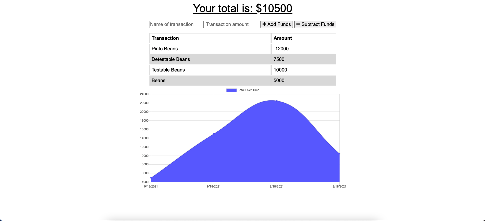

# Online-Offline-Budget-Trackers

   

## Deployment
[Budget-Tracker](https://budget-tracker.ethanharsh.com/)

## Application Screenshot

## Description

Track your budget and reach your goals!

## Project Goals:

- Create, Read, and Update MongoDB data using Mongoose
- Create a Progressive Web App that runs offline.
- Store user form responses in IndexDB

## Skills Learned

- [Express](https://www.npmjs.com/package/express)
- [Node.js](https://developer.mozilla.org/en-US/docs/Glossary/Node.js?utm_campaign=feed&utm_medium=rss&utm_source=developer.mozilla.org)
- [mongoose](https://www.npmjs.com/package/mongoose)
- [MongoDB](https://www.mongodb.com/)
- [PWAs](https://web.dev/what-are-pwas/)

## Resources

- [Node.js Documentation](https://nodejs.org/en/docs/)
- [Mongoose](https://mongoosejs.com/docs/api.html)
- [MongoDB](https://docs.mongodb.com/guides/)
- [PWAs](https://web.dev/progressive-web-apps/)
- **General Reference ->** [MDN](https://developer.mozilla.org/en-US/)
